# <center>**The Homemade Kitchen**

## Milestone 3 Project - Backend Development Milestone Project

### [View live project here](https://ms3-cookbook-project.herokuapp.com/)
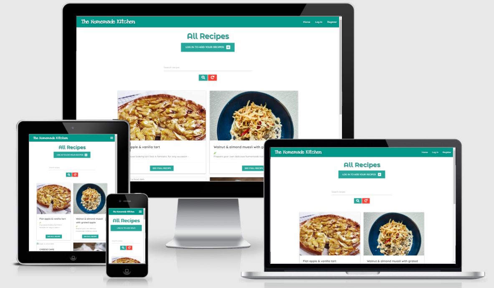

## Overview

This website is a virtual cookbook to save and keep track of personal recipes and allow other users to share with others their own culinary creations, family traditions, etc.

The website will be responsive and accessible on all devices, but it's optimized to be seen on medium or small screens, as the user will want to have the device close to them to be able to cook along with it. The website will be visually simple but pleasant, focusing on the posibility to update the data available to the user. It will be aimed for those people who want to store and share their own cooking creations with others.

---

## Table of Contents

1. [UX](#ux)

- [User Stories](#user-stories)
- [User Centered Design](#user-centered-design)
  - [Strategy plane](#strategy-plane)
    - [User needs](#user-needs)
    - [Technical capabilities](#technical-capabilities)
  - [Scope plane](#scope-plane)
  - [Structure plane](#structure-plane)
  - [Skeleton plane](#Skeleton-plane)

2. [DESIGN](#design)

- [Color scheme](#color-scheme)
- [Typography](#typography)
- [Imagery](#imagery)
- [Logo](#logo)

3. [DATABASE MODEL](#database-model)

- Users Data
- Recipes Data
- Courses Data

4. [FEATURES](#features)

- [Existing Features](#existing-features)
- [Features left to implement](#features-left-to-implement)

5. [TECHNOLOGIES USED](#technologies-used)

- [Syntax](#syntax)
- [Frameworks, Libraries & Programs](#frameworks-libraries-&-programs)

6. [TESTING](#testing)

- [Testing document](TESTING.md)

7. [DEPLOYMENT](#deployment)

- [Heroku](#heroku)
- [Forking the repository](#forking-the-GitHub-repository)
- [Making a local clone](#making-a-local-clone)

8. [CREDITS](#credits)

9. [REFERENCES](#references)

10. [ACKNOWLEDGEMENTS](#acknowledgements)

## UX

### **User stories**

 #### As an anonymous user I want to:
  - see all the recipes on the main page
  - to be able to find information effortessly
  - not to be able to add any recipes without registered
  - Not to be able to edit/add/remove any recipes others have created

 #### As a registered user I want to:
  - be able to manage my own posts by editing and/or deleting them
  - be able to create my own recipes and post them for everyone to see them
  - not to be allowed to remove any other posts except mine
  - not to lose any recipes because others have removed it

 #### As the admin I want to:
  - be able to delete any users recipes 
  - be able to edit any users recipes
  - have unique access to all features 

---

## USER CENTERED DESIGN

### **Strategy Plane**

- #### User needs

The main goal of this website is to convert visitors into active users. As this website aims to create a sense of community for those users that want to share their own recipes, all users will be able to search and see all recipes, leaving the options to create, edit and delete recipes will be only available to registered users. To convert a visitor the landing page will display all recipes to convince users to continue using the website, allowing them to become registered users. The website will show a bright palette as well as minimalistic but aesthetically pleasing imagery to invite users to start cooking themselves.

There is already thousands of recipe and cooking websites, but not many of them allow users to contribute into them. Many of us have recipe notebooks at home, that when most needed are not accessible, or we cannot find them. But most of us have the phones close to us most time of the day. Taking this in account, this website is the perfect place to create a profile where you can savely store our most precious recipes, where will be saved for (virtually) forever. 

The steps a new user would idealy take when arriving into the website would be the following:

 - Explore the websites landing page, where the information will explain the user the reason to be of the site.
 - Create a new account.
 - Explore the additional features available to registered users.
 - create their own recipes and see them posted on the main page
 - Access and edit posted recipes to be able to update/make changes on them.
 - Delete created recipes that the user doesn't want to see anymore.

This will all be achieved through creating a clear and strong UI focusing on well structured content. Having a clear hierarchy will allow the user to navigate and use the functionality of the website without the need of instructions.

- #### Technical capabilities

  - To use this site the user needs to have access to some internet connection within their chosen device.

  - They also need to have basic understanding on how to select and navigate the page.

  - This page will be done with Materialize framework to create a responsive structure and implement sections that the user needs. The website will be kept separated in 5 main sections (landing, sign in, log in,, add recipe, edit and delete recipe) but easily accessible from the homepage (the functionalities of add edit and delete will be just available for registered users). The admin will have an extra section to add more courses to allow the searches be more specific and easier to group for users. 

---

### **Scope plane**

- **Features within the design plan with highest priority:**

  - Minimal but appealing homepage 
  - Navigation links clearly visible on the top of the website.
  - Responsive navigation bar
  - Only allow registered users to create and manage their own account.
  - Only allow registered users to create recipes with full CRUD functionality.
  - A form with steps to allow users create their recipes fast and easily

- **Lower priority features that may not be included in the initial release of the website:**

  - Responsive sticky navigation bar.
  - The ability for logged in users to search the websites database
  - Search bar on the navigation bar so the users have fast access to recipes
  - Contact section to send an email to the Admin
  - A comment section that allow all users to write their own opinions under each recipe
  - A recipe rating option with stars
  - A gallery section for the users to upload their own images of created recipes.

---
### Structure Plane

- The structure of the site will be layed out in four pages (five pages for admin).The landing page (homepage) where the user will be able to see all the recipes available. Anonymous users will be allowed to navigate through all recipes, being able to see them in its own page, to easily read the recipes. If an anonymous user wants to become a member, they have the option to log in, add recipe, edit and delete recipe their own recipes once they have registered and logged in. When a user logs in, they will directed to their profile, where they can choose what to do. Members are only able to manipulate the recipes they have created. Only the admin user has access to all functionalities. The admin user has the capability to add new courses, which will then be available in the dropdown for users to select. Logged in users will have the logout option to stop their session cookies. The basic structure of the website is:

  - Header/Navigation - Top Level

    - The navigation menu will be a hamburger/bars menu icon on smaller and medium screen sizes. It is not sticky as the users have all available functionality in various places repited on the website. The hamburger menu will be located in the top right corner allowing the user to navigate with a single hand. The navigation bar will have extra links with access to the CRUD functionality for members only. 
      - Anonymous users will only be able to see the following links: Home (all recipes), Log in and Register.
      - Registered and logged in users will be able to see the following links: Home (all recipes, available to all), Profile(personalized with each users name and options to add a recipe and see all recipe links), Add recipe (direct link to a form to add a new recipe), Log Out (end session). 
      - Admin user has access to all links to functionality registered users have plus the option to add a course.
    - The navigation bar will be responsible and will reduce to a hamburger size to keep all links tidy and organized. The hamburger menu will be positioned on the right side so users can access to the navigation links with the right hand. 

  - Body 
  
    - Home Page Elements: 

      - Under the navigation bar, anonymous users will see a button prompting them to register or log in to be able to share their recipes. Logged in users and admin user will be able to see a button linked to add recipe. This allow the user to have the option to add a recipe from the main page without the need to open the hamburger menu to access the navigation link. The idea of this is to allow the user navigate the website with as few clicks as possible. 
      - Under the button there will be a search bar so the user will be able to find their recipe on a fast manner. This functionality is available to all type of users.
      - All recipes will be displayed on individual cards, which will contain an image as a visual representation and guide for a finished product, the card title, a very short description, a little carrot to with a toolkit if the recipe is vegetarian and a button to display the whole recipe and all the data on a separate page.
      - At the bottom of each recipe will have a delete button on the left and a green edit button on the right. This will only be visible for recipes created by the the user or for the admin user. 
      - The delete call to action button will open a modal to ask the user to verify their decision.
      - The edit button will open the edit form with populated fields so the user can see the precious data and choose what to change.

    - Register Page Elements:

      - A card containing a form with input fields for a possible user to enter their username, password and another input field to confirm the entered password.
      - A call to action button to add the username and password to the MongoDB database. If successful the user will be redirected to their new profile page and displayed a flash message confirming the registration to the database.
      - The new registered user will now have access to the rest of functionalities (add, edit and delete recipes)

    - Profile Page Elements (only accessible to authenticated and authorized users):

      - The user will be welcomed with a message and the users username. 
      - A flash message will give feedback when logged in.
      - Three cards divided in two columns will display options to the user:
        - See all recipes: redirects the user to the home page displaying all recipes
        - Add a new recipe: redirects the user to the add recipe form
        - ONLY FOR ADMIN: Add a course: redirects the admin user to the add a course form
      - A Logout button for users who want to end the session from the profile page.

    - Add Recipe Page Elements (accessible to all logged users):

      - The user will be presented with a form with inputs and dropdowns the user to fill and select options.
      - The required inputs and dropdowns will be underlined in red color if not filled. Properly filled fields will be underlined in green.
      - All fields will have placeholders or labels to hint the user on the information needed for each input.
      - A switch to choose if the recipe is vegetarian or not
      - The user will have two buttons at the end to cancel and be redirected to the home page or a submit button to add the data to MongoDB. Once the recipe has been successfully registered the user will get a flash message as feedback and will be redirected to the home page where the user will be able to see all the recipes including the new inserted one.
  
    - Add Course Page Elements (accessible only to admin):

      - A single input form to allow the admin user inset extra course types to database. All the courses will be displayed once the admin clicks on either the cancel or add buttons.
      - All new courses the admin adds are available when the user is creating or editing a recipe under the 'recipe type' dropdown.

    - Edit recipe (not accessible from the navbar):
      
      - Users are able to access to this page from two different places: on the homepage under the recipe cards and under the view of the full recipe
      -  When clicked on the green edit button, the user will be able to see the information that they inserted previously, so they can review the information and make the necessary changes to them.
      - When the user submits the form, this information updates the data already stored on the database under the specific id number.

    - Manage Course (only available to admin user):
      
      - Admin will be shown all the courses available on cards. At the bottom of the card the admin user is allowed to edit or delete the course chosen.
      - The delete button will trigger a modal prompting the admin user to confirm if they want to delete or cancel the action.
      - The edit button will open the course form already filled, so the admin user can edit it and update the database with the new information.

  - Footer - Bottom Level
   
    - The website name
    - Copyright simbol
    - The creator name
    - Social links to allow users to further connect and interact with the 'community' by following the social media accounts for the page.

---

### Skeleton Plane

#### Wireframes:
  - [Mobile Wireframe](docs/wireframes/Mobile-wireframes.png)
  - [Ipad Wireframe](docs/wireframes/Ipad-wireframes.png)
  - [Desktop Wireframe](docs/wireframes/Desktop-wireframes.png)


## DESIGN

The design of the website was created to be as simple but pretty as posible, not to distract the user with too many color schemes and trying to bring the focus to the picture of the recipes to tempt the user to return and become members.

### **Color scheme**

The colors used in this project are very simple, to keep a minimalistic and tidy website, as well as keeping the color contrasts the highests posible to facilitate the screen readers and make this site accessible to all.

The colors chosen are combinations of: teal with white text, blue for add course button, orange to log out, red for delete and green for edit. This colors where taken from the [Materialize](https://materializecss.com/color.html) css section. 

- #26a69a: for navbar, course card background, headers and most home page buttons to keep a balance between the images and the rest of the buttons.
- #f44336: for delete buttons
- #4caf50: for edit buttons
- #03a9f4: to add card button, add recipe submit button, edit recipe button, cancel button on modal.
- #ff9800: for logout button on profile page.

---

### **Typography**

The fonts used for the site were taken from [Google Fonts](https://fonts.google.com/). To make sure the questions are represented on a fun way but easy to read, it was decided to use simple but and consistent fonts previously used in other projects within Code Institute like:

- "Love Ya Like A Sister": used for the name of the website
- "Montserrat alternates": to create fun and attractive fonts as well as drawing attention to the most important information.
- "Quicksand": for more suttle but attractive font. It's clean and simple, making this a pleasant font to look at.
- Sans-serif: used as a fallback font in cases there is an issue when importing fonts or the browser does not support these.

---

### **Imagery**

- As this project will be focused on the data rather than the frontend design of the website, the images will be included as an URL. The user will have to provide a URL to add the respective image to the top of the recipe. This image can be used as a guide of the end product of that certain recipe.

- Although in the beginning a background image was added, it made the important information lose importance, so I decided to add a simple background displaying simple fast-food graphics that gives fun feeling to the user, but it does not take over the user's focus of the main information.

---

### **Logo**

- The favicon was created using [Favicon.io](https://favicon.io/favicon-converter/) and the logo used to create it was created using an online application called [Canva](https://www.canva.com/). It represents cooking tools nodding the  main subject of the website. The use of the favicon makes it easier to recognize the application tab in between others that the user might have had already opened.
( *This logo was not used in the final draft*)

- As a logo, I used the Name of the website, as the words already explain what the website is about. The typography used was imported from google fonts called 'Love Ya Like a sister'.

---

## **Database Model**

- This project have been made using MongoDB for since MongoDB allows a cross platform document-orientated database program. Classified as a NoSQL database program it uses JSON-like (BSON) documents with optional schemas.

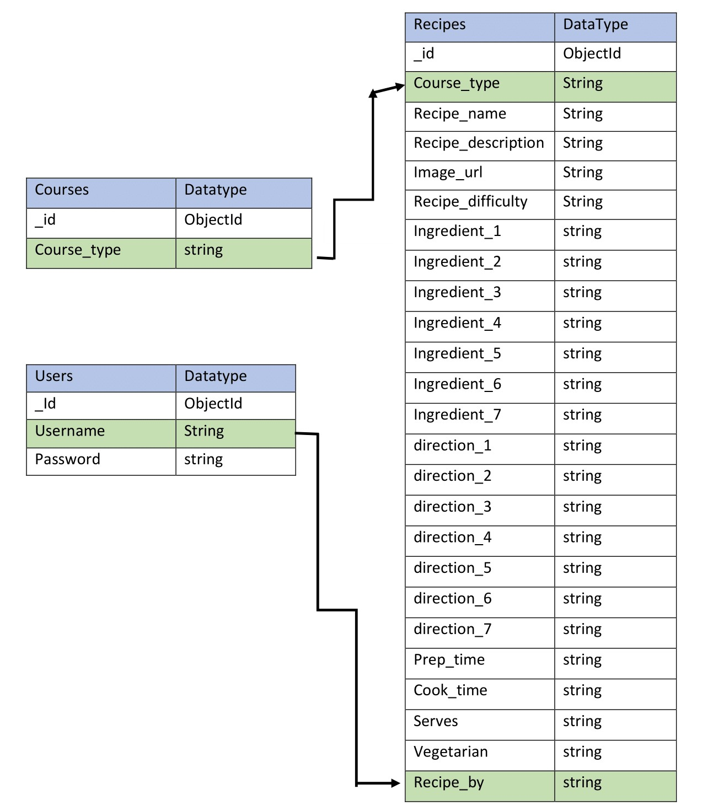

- The main schema used in this project is ObjectId.
  - The objectId gives each object a unique value that can be used as identifier.
  - the objectId is added to each item created inside a collection which can later be used to manipulate by searching the database by using the ObjectId.

- The three collections in this database are:

### Users data

All user registrations will be stored in this collection. The passwords are securely stored by using Pythons Wekzeug Security password hash. This generates a random character string which is converted into a unique, irreversible bit array. 

    | Users              | Data Type     |
    | ------------------ |:-------------:|
    | _id                | ObjectId      |
    | username           | string        |
    | password           | string        |

### Recipes data 
  
The website is based around this collection.

  - Users can add a recipe that is added into the database which stores each users recipe. This recipe is connected to the user collection by the recipe_by and to the courses collection by the type of recipe

  - Some fields from this collection are used to search the database by: name, course type, difficulty.

    | Recipes            | Data Type     |
    | ------------------ |:-------------:|
    | _id                | ObjectId      |
    | course_type        | string        |
    | recipe_name        | string        |
    | recipe_description | string        |
    | image_url          | string        |
    | recipe_difficulty  | string        |
    | ingredient_1       | string        |
    | ingredient_2       | string        |
    | ingredient_3       | string        |
    | ingredient_4       | string        |
    | ingredient_5       | string        |
    | ingredient_6       | string        |
    | ingredient_7       | string        |
    | direction_1        | string        |
    | direction_2        | string        |
    | direction_3        | string        |
    | direction_4        | string        |
    | direction_5        | string        |
    | direction_6        | string        |
    | direction_7        | string        |
    | prep_time          | string        |
    | cook_time          | string        |
    | serves             | string        |
    | vegetarian         | string        |
    | recipe_by          | string        |

### Courses data 
  
This courses are available to the user as a selection dropdown when they add a new recipe. Only admin user is allowed to create a new database and add it into the collection. 

  - The course type connects this collection with the recipes collection.

  - It is also used to search for a course type

    | Courses            | Data Type     |
    | ------------------ |:-------------:|
    | _id                | ObjectId      |
    | course_type        | string        |
      
---

## FEATURES

### Existing Features

- Responsive on all screen sizes
- All buttons and links will be styled with hovering effects to invite the user to click on them.
- The logo on the navbar redirects the user to the home page.
- User gets custom feedback on success or error operations 
- 404 page display when the user tries to access an unauthorized page or there is an external error
- 500 page displays when there's a server error.
- If a non authroized user tries to open a page that has not access too, they will be blocked and redirected to a 404 page denying the access.
- Non authorized users will not be able to access already deleted recipes.
- The logout link removes the session cookies of users.
---

#### **Homepage (All recipe page) specific features:**  

- Displays all recipes to all users, regardless they are registered members or not
- If the user is logged in, this page will display option to delete or edit the recipes the logged in user has created. 
- A call to action button under each recipe card allowing to expand the whole recipe on a separate page. This is so the user can have a single recipe fully displayed while they are cooking, so it's easier to follow the instructions.
- A search bar to narrow the search to find specific recipes, courses, difficulties. This is available to all users regardless their user status.
- For logged users: the delete button will open a modal for the user to confirm or cancel the action. The edit button will open the specific clicked recipe on a page so the user can see the previous data and can edit it accordingly.

---

#### **Specific Register page Features:**

- Specific error messages are diplayed if the user does not fill all the required input fields. To allow the users to use characters and numbers, a regex pattern attribute is used. This fields also contain max and min attributes to make sure the user enters specific amount of characters.
- Input fields for users to create a username and password
- Specific field to confirm the passwords match
- A submit button to register the data on the database
- A call to action button for users already registered redirecting them to the login page

---

#### **Specific Log In Page Features:** 

- A personalized message to each user is displayed on log in
- The user is given a fast and direct access to all recipes and addition of recipe. Admin user is given the option to add new catrds from its profile page.
- A logout button is displayed at the botton for uses to logout without accessing the navigation links.
- Uppon login, the user will be redirected to their profile page and will display a message as confirmation.

---

#### **Specific Add recipe Page Features:** 

- The user is presented with a form separated in three parts: course type and difficulty, recipe information and cooking instructions and ingredients.
- The user has to choose the course difficulty and course type from a dropdown menu. The course difficulty will include the option the admin has created. 
- Two collpasible bars to input the ingredients and the steps required for the recipe. This was done so the form is more condense, instead of the user needing to scroll, and only opening them when the user reaches this section.
- A switch so the user can select if the recipe is vegetarian or not. This will display a little green carrot under the recipe card title so it's visually recognizeable for those users looking for a vegetarian recipe.
- Thow buttons alowing the user to add the recipe or cancel the operation. 

---

#### **Specific Add course Page Features:** 

- Only accessible for the admin user
- The add recipe button redirects the admin user to the page where all courses are displayed. Here the admin has the option to edit, add more, or delete the courses.
- Upon clicking the delete button, admin user will be prompted to confirm or cancel the operation.

---

#### **Specific Admin user Features:** 

- Admin user has access to all pages
- Admin has the option to remove or edit any users recipes.
- Admin has a specific tab where they have the possibility to create edit or delete courses. This option is also shown on the Admin's profile 

---

#### **Specific Edit Recipe Features:**

- The form opens prefilled, so the user can see the information previously entered so they can see what information they want updated. 
- A submit button to update the information on the db.
- A cancel button to cancel the operation and get back to the main page.

---

#### **Specific Delete Recipe Feature:**

- A modal that opens a confirmation box where the user has to accept their decision.
- The modal give the user a cancel choice or an edit choice in case the user has changed their mind.

---

#### **Specific Security Features:**

- If a user gets hold of a link that does not exist anymore, the user will be redirected to a 404 page
- If a user tries to edit a recipe that does not exist, they'll be redirected to ad 404 page.
- If there is a server error, the user will be redirected to a 500 page.
- If the user and the recipe_by don't match, the user will be redirected to a 404 page
- If the user is not logged in, the user cannot add any recipes
- If the user is not admin, the user cannot add any courses
- If admin is not logged in, admin cannot create, edit or delete courses
---

### Features left to implement

- The option for the user to upload their own images: as it was adviced by student care, this functionality was left out, but would be implemented further down the course, as it will be taught in future lessons.
- Give the option to download all created recipes to create a personalized cookBook and be able to make profit from this
-  Active page class to let the user know which page they are currently on: Although this was an easy input before using flask, I have found this a challenging step to add to this project. As I have been short with times, I have decided to leave this feature for later realeases when I have some extra time to expand the MVP.
- Pagination: to organize many recipes pages, to avoid the user endless scrolling.
- The option for users to personalize their profile with images and custom recipes.
- The option for users to delete their account from the database.
- The option to have a few super access users, like more than one admin.
- A section for users to add comments and option to share their recipes with others via email, whatsapp, facebook...
- A contact form option users to request course types or modifications...
- The option to allow admin users to block or remove users
- In concern to the database, a future release would have a list of ingredients stored on it, so even if the UI changes the backend wouldn't change. This will be inplemented on a feature release as I ran out of time to implement this fix to the backend of the project.
- A feature where users can update and recover their password if they have forgotten it.

---

## TECHNOLOGIES USED

### **Syntax**

-  [HTML5](https://en.wikipedia.org/wiki/HTML5):
  - HTML5 is a markup language used for structuring and presenting content on the internet.

- [CSS](https://en.wikipedia.org/wiki/CSS):
  - Cascading Style Sheets (CSS) is a style sheet language used for describing the presentation of a document written in a markup language such as HTML
- Markdown (for README.md, REFERENCES.md and TESTING.md)

- [JavaScript](https://en.wikipedia.org/wiki/JavaScript):
  - Javascript is a lightweight, interpreted, object-oriented language with first-class functions, and is best known as the scripting language for Web pages, but it's used in many non-browser environments as well.

- [JQuery](https://jquery.com/): 
  - jQuery is a JavaScript library designed to simplify HTML DOM tree traversal and manipulation, as well as event handling, CSS animation, and Ajax.

- [Python](https://en.wikipedia.org/wiki/Python_(programming_language)):
  - Python is an interpreted high-level general-purpose programming language.Its language constructs as well as its object-oriented approach aim to help programmers write clear, logical code for small and large-scale projects

---

### Frameworks, Libraries & Programs

- [Balsamiq](https://balsamiq.com/) 
  - Used to create wireframes for each website page on various devices and screen sizes.

- [Font Awesome](https://fontawesome.com/)
  - used to include inline icons as representation and support of information

- [Materialize](https://materializecss.com/) with [JQuery](https://jquery.com/)
  - was used for responsiveness using the grid system
  - jQuery was used alongside the Materialize library to initialize used components.

- [Google Fonts](https://fonts.google.com/)
  - Used to import the three fonts used throughout the site 'Quicksand', 'Montserrat Alternates' and 'Love Ya Like A Sister'.

- [Hover.css](https://ianlunn.github.io/Hover/)
  - A library with ready to use hover effects. It was used for most links and buttons. The effect used was hover grow.

- [GitHub](https://github.com/)
  - Used to host the entire repository for the project.

- [GitPod](https://www.gitpod.io/)
  - The code editor used to build the entire project.

- [TinyPNG](https://tinypng.com/)
  - Used this to compress the image used on the website to decrease the file size. (Images were not included on the end draft)

- [Favicon](https://favicon.io/)
  - Used to generate the websites favicon logo of various sizes for different devices.

- [Hero Patterns](http://www.heropatterns.com/)
  - A collection of repeatable SVG background patterns for you to use on web projects.
  - Used for the background pattern of this project.

- [Am I Responsive](http://ami.responsivedesign.is/)
  - A tool to check how the website appears and the functionality on various devices. The mockups on this document was generated with this tool.

- [[Media Genesis](https://responsivedesignchecker.com)]
  - A tool to check the responsiveness on various device sizes.

- [Responsinator](http://www.responsinator.com/)
  - Similar to [Am I responsive](http://ami.responsivedesign.is/) this is a web based application that allows a website to be checked an a large amount of devices in portrait and landscape view.

- [W3C Validator HTML](https://validator.w3.org/) & [W3C Validator CSS](https://jigsaw.w3.org/css-validator/)
  - Both of these were used to test all the code for the project whilst working and for the finished website to check for valid HTML and CSS.

- [JSHint](https://jshint.com/)
  - This is a tool used to detect errors or potential problems within Javascript code, used to test and validate all Javascript written for this project.

- [Pylint](https://www.pylint.org/)
  - Pylint is a source-code, bug and quality checker for the Python programming language.

- [Jinja](https://jinja.palletsprojects.com/en/3.0.x/)
  - Jinja is a web template engine for the Python programming language. It allows writing code similar to Python syntax. Then the template is passed data to render the final document.
  - Jinja templating is built into the [Flask](https://flask.palletsprojects.com/en/2.0.x/) library.

- [PyMongo](ttps://pymongo.readthedocs.io/en/stable/)
  - PyMongo is the official MongoDB Python driver for MongoDB.

- [Flask](https://flask.palletsprojects.com/en/2.0.x/)
  - Flask is a micro web framework written in Python. It is classified as a microframework because it does not require particular tools or libraries.
  - Flask requires the [Jinja](https://jinja.palletsprojects.com/en/3.0.x/) template to work

- [Flask PyMongo](https://flask-pymongo.readthedocs.io/en/latest/)

- [Heroku](https://id.heroku.com/login)
  - Heroku is a cloud platform as a service (PaaS) supporting several programming languages.
  - The Heroku network runs the customer's apps in virtual containers which execute on a reliable runtime environment.

- [BrowserStack](https://www.browserstack.com/)
  - This application was used to test the functionality and appearance of the project on all main browsers.

- [w3schools](https://www.w3schools.com/)
  - used to refresh the lessons learned in the course in a summed up way

- [Stack overflow](https://stackoverflow.com/)
  -to check questions to find solutions to problems and bugs I encounter during the creation of the website

- [CSS Autoprefixer](https://autoprefixer.github.io/)
  - used to add vendor prefixes to the CSS used in the project to increase cross browser compatibility.

- [Media Genesis](https://responsivedesignchecker.com/)
  - used to check responsiveness on different device and viewports

- [Jpg2pdf](https://jpg2pdf.com/)
  - used to combine images into a single file

---

## TESTING 

Find the Testing document [here](TESTING.md)

---

## DEPLOYMENT

### Version Control
  -This project was developed using the code editor [GitPod](https://www.gitpod.io/) and pushed to the remote repository hosted on [GitHub](https://github.com/).

  - As in this project the focus was on data, I decided to build all on the main branch. I commited every time a feature was created.

### Heroku

This project is live and automatically deployed on [Heroku](https://id.heroku.com/login)
In order to successfully deploy the application that uses Python and MongoDB, the followin steps were taken: 

  1. Create and open a GitPod workspace

  2. Ensure that the project dependencies and requirements are set up. This can be done introducing the `pip3 freeze --local > requirements.txt` on the terminal. This will create a file called `requirements.txt` where all the installed packages will be stored.

  3. Once the `requirements.txt` file is created, a file called Procfile must be added too. Heroku needs this app to execute and run the app. To create the Procfile file type `echo web: python app.py > Procfile`. Open this file and remove the last blank line. This might cause issues with deployment.

  4. Create another file called `env.py` to store the following variables:
  - IP 
  - PORT 
  - MONGO_URI 
  - SECRET_KEY 
  - MONGO_DBNAME 
  
  5. Commit and Push these new files to the GitHub repository.

  6. Visit Heroku and create/log in your account.

  7.  Under the profile picture, Select 'New App'.

  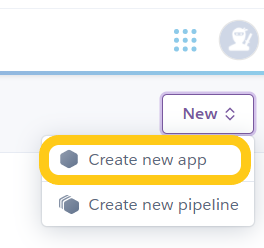

  8. Input a project name (it has to be unique), select the region closes to you, and click on Create app.

  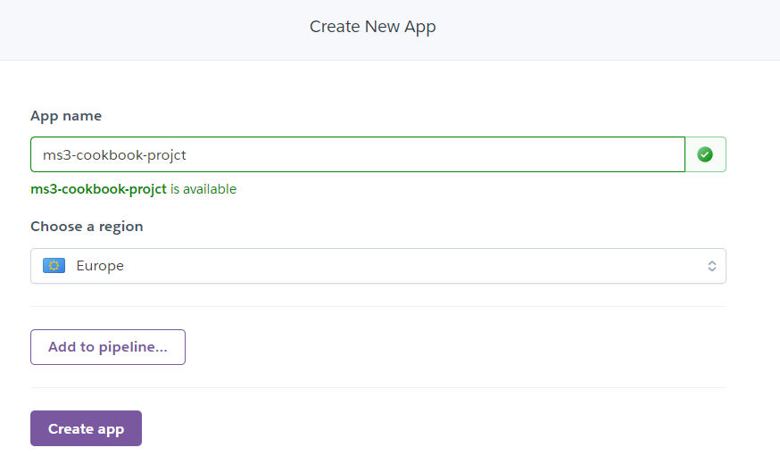

  9. This will redirect you to the deploy screen. You have the options to deploy connecting Heroku via the CLI (follow the instructions provided) or connect through the GitHub account. This is the way we deployed:

  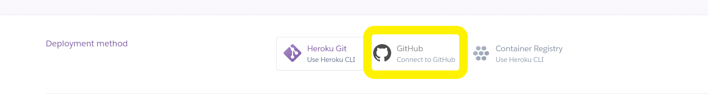 

  10. Make sure the GitHub account is displayed and search for the repository to be connected to Heroku.

  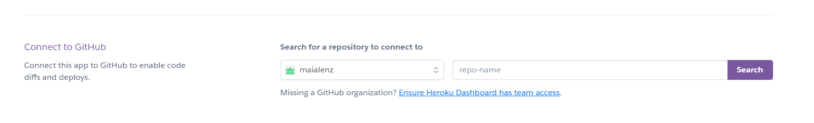

  11. Click on the settings tab and go to the `Config Vars` section. Click on `Reveal Config Vars`. This will show the input fields needed to be filled with the key pair values we previously added to the env.py file. Add them making sure not to add any quotes on any of the fields. (secret key and password values have been covered on the image below)

  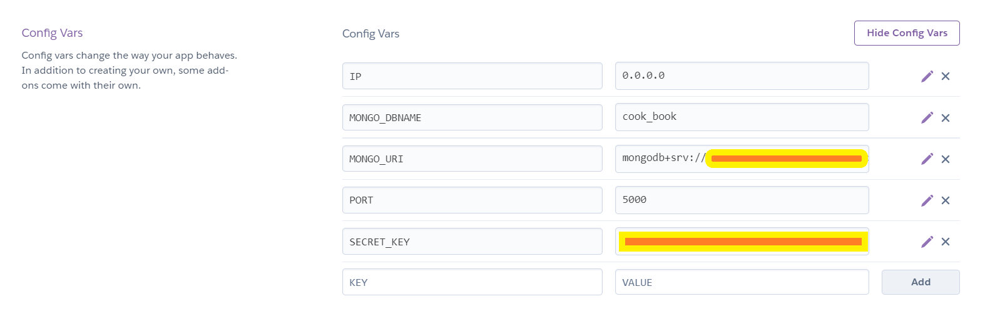

  12. Return to the Deploy tab and inside the 'Automatic deploys' section select 'Enable Automatic Deploys' to the master branch.

  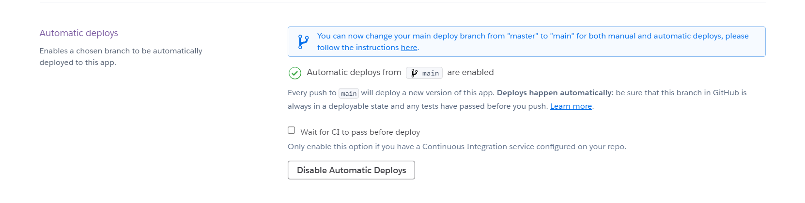

  13. Heroku will start building the app. When finished and if successful a message and a `view` button will appear. 

  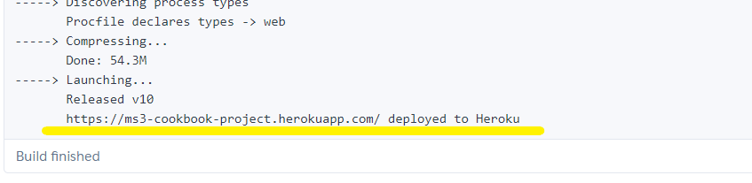

  14. Now all the commits pushed to GitHub will automatically be deployed to Heroku!

---

### GitHub

#### Forking the GitHub Repository

It is posible to copy and edit this project by any user without changing the repository on the original GitHub account. This can be done by forking the repository by following the following steps (Forking will only make a copy of the original project, so any changes won't affect the original):

1. Log in to [GitHub](https://github.com/join/get-started) and locate the [GitHub repository](https://github.com/maialenz/cookbook)

   - You can also find it by seaching maialenz/cookbook on the [GitHub](https://github.com/) seach-bar.

2. Below the repository title at the top, above the "Settings" button on the horizontal menu and under the user's profile logo, locate the "Fork" button and click on it.
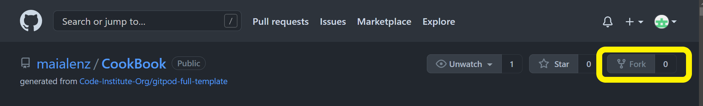

3. You will have made a copy of the whole repository in your own GitHub account.

4. To share the changes/edits you have made to improve the original project with the owner, you can submit a pull request. Find the details to do so following this [link](https://docs.github.com/en/github/collaborating-with-issues-and-pull-requests/creating-a-pull-request-from-a-fork).

#### Making a local clone

1. Log in to [GitHub](https://github.com/join/get-started) and locate the [GitHub repository](https://github.com/maialenz/cookbook)

  - You can also find it by seaching maialenz/cookbook on the [GitHub](https://github.com/) seach-bar.

2. Above the repository files and to the left of the green "GitPod" button, locate the "Code" or "download" button and click on it.
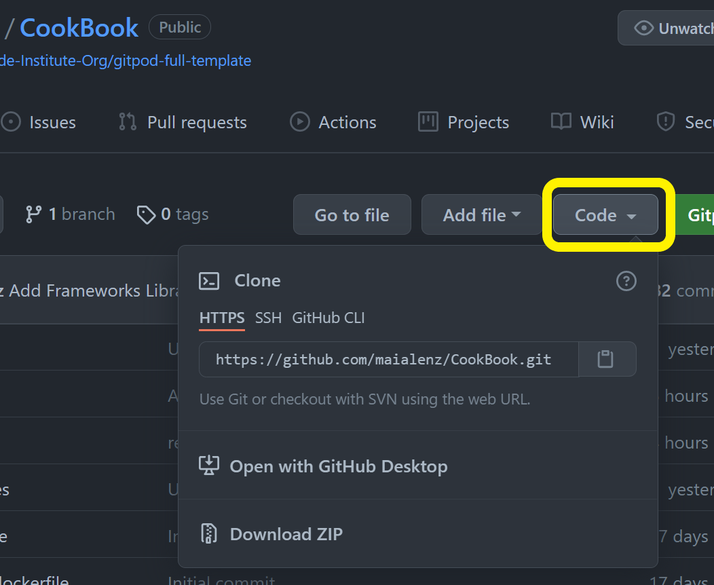

3. To clone the repository using HTTPS copy the link on display (you can click on the clipboard to copy it faster).
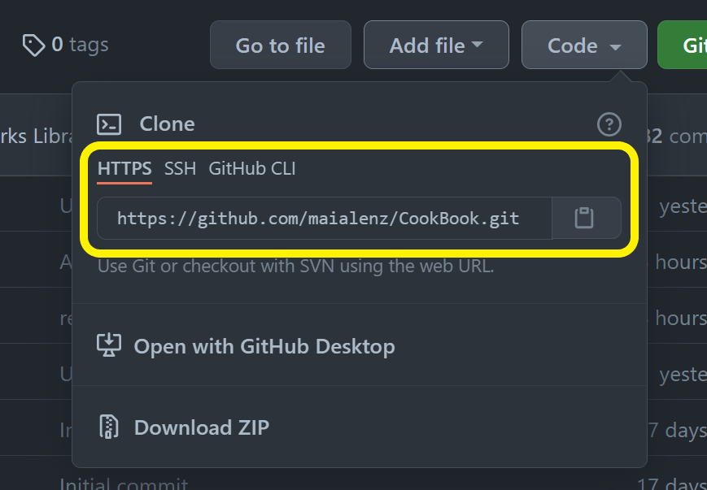

4. If you are working on a desktop application, follow the documentation found on number 5. For cloud based, open your own terminal in GitPod or your preferred IDE (we will be using Gitpod).

  - For this project, we created a new workspace environment in GITPOD by using Code Institute's [Full Gitpod template](https://github.com/Code-Institute-Org/gitpod-full-template). To open it, just click on the Use this template button and all the necessary tools will be added to the work environment without the need of manually installing them. It takes a few minutes to load.
  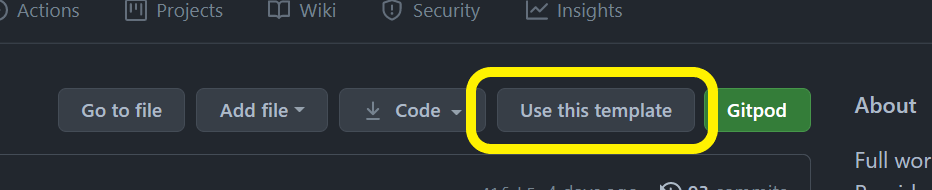

5. If you use GitHub desktop follow the steps documented [here](https://docs.github.com/en/github/creating-cloning-and-archiving-repositories/cloning-a-repository#cloning-a-repository-to-github-desktop).

---

#### Gitpod workspace after copying the HTTPS clone link

1. Change the current working directory to the location where you want the cloned directory to be made.

2. In the terminal type `git clone` and then paste the URL copied on step 3

```
$ git clone https://github.com/YOUR-USERNAME/YOUR-REPOSITORY
```

3. Press Enter. This will create your local clone.

```
$ git clone https://github.com/YOUR-USERNAME/YOUR-REPOSITORY
> Cloning into `CI-Clone`...
> remote: Counting objects: 10, done.
> remote: Compressing objects: 100% (8/8), done.
> remove: Total 10 (delta 1), reused 10 (delta 1)
> Unpacking objects: 100% (10/10), done.
```

4. To open a preview port within your own local workspace type within gitpod, enter the following command on the terminal:

```
$ python3 app.py
```

5. Once your Gitpod workspace is created, only open the workspace from Gitpod Workspaces itself (https://gitpod.io/workspaces/), and not from GitHub Gitpod button (Only use this button once at the very begining when creating a new workspace)
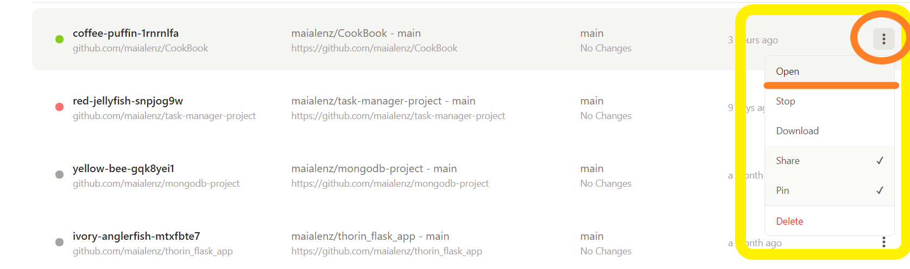

---

## CREDITS

As this has been the first Backend project, I found this project to be quite very challenging. To refresh the lessons learnt during this module, I used a great variaty of documentation and tutorials to help build the basics and work from that point onward. Following the Ethos learned in Code Institute (Don't repeat yourself), I reused some of the code I previously wrote for the previous milestones. The reused code had been previously written by myself.
Furthermore, I revisited the Authentication videos used for the miniproject to create the base on which I later built my own application, so some of the code is very similar to Tim's.

- Credits to [Hero Patterns](https://www.heropatterns.com/) for the customized background pattern I used on the whole html element.

- To my mentor for helping me write a condition to block unauthorized users from gaining access to blocked content.


## REFERENCES

- Referenced the [Werkzeug Documentation](https://docs.microsoft.com/en-us/dotnet/api/system.security.cryptography.sha256.create?view=net-5.0) to read and learn more about sha256 and hashing passwords.
- Used [Flask Documentation](https://flask.palletsprojects.com/en/2.0.x/patterns/flashing/) to check how flashing messages work and how to apply them to my project
- Helped me adding styles to fix background issue: [Stackoverflow](https://stackoverflow.com/questions/51555645/materializecss-how-to-make-image-cover-full-width-within-grid) This was removed for the final draft, but helped me understand how to add styles to backgrounds with css.
- Helped me to apply it to my css stylesheet to remove padding from the bottom of images.[Stackoverflow](https://stackoverflow.com/questions/45921384/remove-bottom-padding-between-rows-materialize/459220280
- Used [MDN Docs](https://developer.mozilla.org/en-US/docs/Web/CSS/line-height) to see different options for line-heights and their properties to be applied on the css stylesheet.
- [Stackoverflow](https://stackoverflow.com/questions/7877522/how-do-i-disable-missing-docstring-warnings-at-a-file-level-in-pylint) this answer helped me add docstrings to app.py file
- The documentation from [Flask](https://flask.palletsprojects.com/en/1.1.x/patterns/errorpages/) helped me create the error handler functions on app.py
- This question and the answers from [Stackoverflow](https://stackoverflow.com/questions/21833872/why-does-pylint-object-to-single-character-variable-names) helped me understand pylint errors about the use of e as parameter inside the error functions.
- This post from [Stackoverflow](https://stackoverflow.com/questions/58008638/how-to-add-images-in-css-file-i-am-using-python-flask-for-website-development) refreshed me on how to add images when using flask and jinja templates.
- This article from [Css Tricks](https://css-tricks.com/perfect-full-page-background-image/) helped me applying styling to the cs file to make the background image fill the page. I did not include any real pictures as background on the end draft.
- [This] post helped me apply opacity to backgrounds on css
- I found the answer to how to make all materialize cards the same highth on this [Stackoverflow](https://stackoverflow.com/questions/2083831/css-background-image-does-not-fill-when-scrolling) post.
- The [Python Documentation](https://docs.python.org/3/reference/compound_stmts.html) helped me build the authorization statements to block users who are not logged in or are unauthorized to access certain pages from gaining access.
- This post from [Stackoverflow](https://stackoverflow.com/questions/643879/css-to-make-html-page-footer-stay-at-bottom-of-the-page-with-a-minimum-height-b) helped me keeping the footer on the bottom. In the last draft I used the materialize footer instead of building it myself.
- I found the solution to the delete recipe and cards problem in this post on [Stackoverflow](https://stackoverflow.com/questions/53046455/mongoose-delete-item-first-one-always-gets-deleted)
- This question on [Stackoverflow](https://stackoverflow.com/questions/7877522/how-do-i-disable-missing-docstring-warnings-at-a-file-level-in-pylint) helped me apply docstrings at a file level when pylint gave me the error.
---

## ACKNOWLEDGEMENTS

To my family for helping me testing this application on their own devices and spending time giving me their opinions and thought so I could improve the User Experience and the User interface.

---

 <center> Project created by <strong>Maialen</strong> | Ireland, September 2021