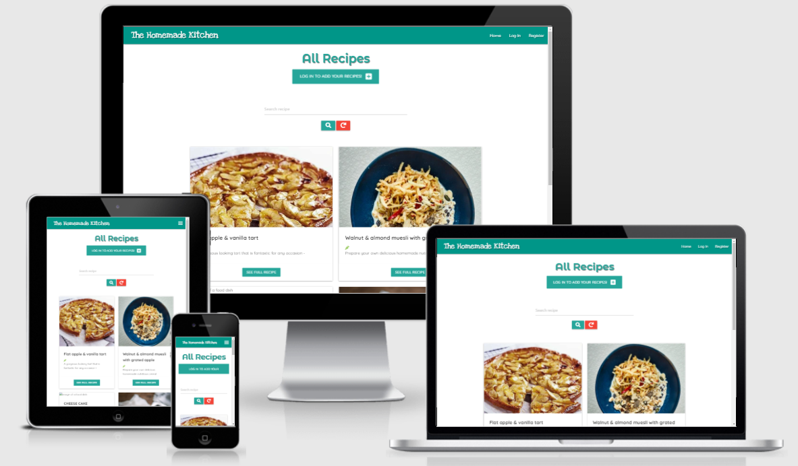

# 
**The Homemade Kitchen**

## Milestone 3 Project - Backend Development Milestone Project

### [View live project here](https://ms3-cookbook-project.herokuapp.com/)

## OVERVIEW

The main reason behind creating this test documentation is to reduce any bugs and errors left on the software, like not working links, responsive issues, font-sizes... and this way improve User Experience and increase traffic to the site.

From the very beggining I used Google Chrome Dev Tools to style and fix the code on real time. This helped fix mistakes and errors on a timely manner as the tool helped to see responsive, styling and typo errors as I coded.

Once finished, I tested my site on a two different phones, laptop, tablet and desktop as well as DevTools and different browsers manually.

## Table of Content

1. [USER STORIES](#user-stories-testing)
2. [VALIDATOR CHECKS](#validator)
   - [HTML](#html-validator)
     - Index.html
     - Game.html
     - End.html
   - [CSS](#css-validator)
     - style.css
     - game.css
     - highscore.css
   - [JSHint](#jshint-validator)
3. [LIGHTHOUSE TESTING](#lighthouse-testing)
   - Mobile
   - Desktop
4. [DEVICE RESPONSIVENESS](#device-responsiveness)
5. [BROWSER COMPATIBILITY](#browser-compatibility)
6. [BUGS](#bugs)
7. [KNOWN BUGS](#known-bugs)
8. [BACK TO README.md](README.md)