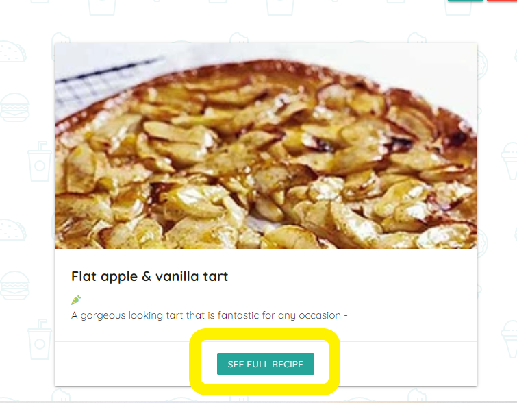
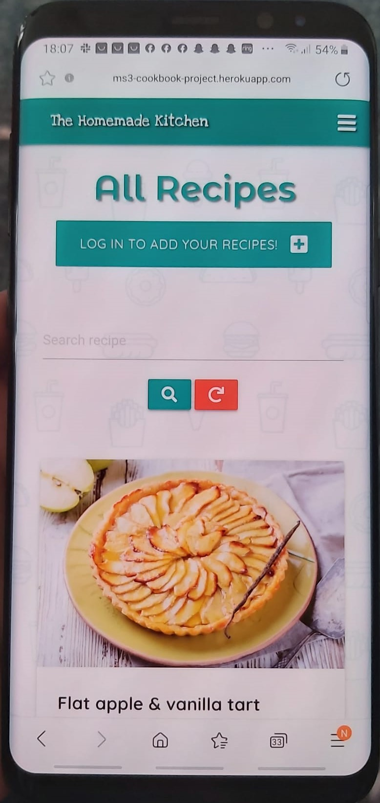

# 
**The Homemade Kitchen**

## Milestone 3 Project - Backend Development Milestone Project

### [View live project here](https://ms3-cookbook-project.herokuapp.com/)

## OVERVIEW

The main reason behind creating this test documentation is to reduce any bugs and errors left on the software, like not working links, responsive issues, font-sizes... and this way improve User Experience and increase traffic to the site.

From the very beggining I used Google Chrome Dev Tools to style and fix the code on real time. This helped fix mistakes and errors on a timely manner as the tool helped to see responsive, styling and typo errors as I coded.

Once finished, I tested my site on a two different phones, laptop, tablet and desktop as well as DevTools and different browsers manually.

## Table of Content

1. [USER STORIES](#user-stories-testing)
    - [Anonymous user](#anonimus-user)
    - [Registered user](#registered-user)
    - [Admin user](#admin-user)
2. [VALIDATOR CHECKS](#validator)
    - [HTML](#html-validator)
    - [CSS](#css-validator)
    - [JSHint](#jshint-validator)
    - [PyLint](#pylint-validator)
3. [LIGHTHOUSE TESTING](#lighthouse-testing)
   - Mobile
   - Desktop
4. [DEVICE RESPONSIVENESS](#device-responsiveness)
5. [BROWSER COMPATIBILITY](#browser-compatibility)
6. [BUGS](#bugs)
7. [KNOWN BUGS](#known-bugs)
8. [BACK TO README.md](README.md)

## USER STORIES TESTING

### **User stories**

#### Anonymous user:

- see all the recipes on the main page:
    - When the user loads the page, it brings the to the page where all recipes are displayed. This is available to non registered or anonymous users.
    

- to be able to find information effortessly:
    - Any user has the option to search for specific recipes by name, by difficulty or course type
    
    
    
    - There is a view full recipe button to open the recipe on a separate page where all the information is displayed
    
    

- not to be able to add any recipes without registered
    - Users have a button on under the navbar which will redirect them to the login page.
    
    
- Not to be able to edit/add/remove any recipes others have created
    - users are not able to add, edit or delete any recipes without being logged in. No buttons are displayed unless a user is logged.  
    - Anonymous users are not able to see any of the buttons available at the bottom of the recipe card.
    

#### Registered user:

- be able to manage my own posts by editing and/or deleting them
    - registered and logged users are able to manage only the recipes they have created from various places.
    
    

    - If the user tries to delete a recipe they created, a modal will be triggered to check if they want to continue with their operation. In the same modal the user is given the option to edit or cancel instead of deleting the recipe.
    
    - Only session users can edit their own recipes. Not available on others recipe (see red box)
    
- be able to create my own recipes and post them for everyone to see them
    - uppon loggin, the user is redirected to the users profile where they can add a recipe from a call to action button located on it, or from the main page where the user has the add recipe button on the top and in the navigation links
    
    
- not to be allowed to remove any other posts except mine
    - in the same way as the visible button for only authorized and logged users, the user can only see the delete button on the recipes that the session user has created. This targets the recipe_by key value. Only username and recipe by matching recipes are available to see to the user. 
    

- not to lose any recipes because others have removed it
    - As the option before, other users don't have the option to see my recipes either.

 #### Admin user:

- be able to delete any users recipes:
    - the admin user has the option to delete all users recipes

    

- be able to edit any users recipes
    - the admin user has the option to edit all users recipes

    

- have unique access to all features 
    - the admin user has access to all funtionality. Admin can delete, edit any course created by any registered user. Furthermore, the user has unique tab for managing categories that are displayed for all user at the time of creating a recipe. This option allows admin user to add, edit and remove course types.

    
    

---

## VALIDATOR:

During the whole project, I continuously checked my code using W3 Validators to make sure I fixed my code as I wrote it. At the end, I ran all the finished pages and made sure all the errors were fixed.

As a css validator, I also used w3 Validator to make sure it checked my style.css file to CSS level 3 + SVG standards.

(See passed validator results at the end of HTML and CSS sections)

### HTML Validator:

- As to develop this project with the [Jinja Templating Engine](https://jinja.palletsprojects.com/en/3.0.x/), the validator would count all url_for() as errors. So I had to validate the code introducing the URL on the [W3 Validator](https://validator.w3.org/) to check the whole website.

- Although the validator gave a warning because a section did not have a header, the reason for this is that this section only shows if there is a message to give feedback to the user. So no header is needed in this case.

- See [HTML Validator results here](docs/testing/validator/html-validator.png)

---

### CSS Validator
- The [jigsaw validator](https://jigsaw.w3.org/css-validator) did not find any errors.

- See [css validator results here](docs/testing/validator/css-validator.png)

---

### JSHint Validator
- [JSHint](https://jshint.com/) did not find any warning or errors.

- See [JSHint validator results here](docs/testing/validator/jshint-validator.png)

---

### Pylint Validator
- After running pylint app.py on the terminal, I got a few warnings:
    - e argument does not user snake_case. I changed this for app_error. This still gives a warning sayin Unused argument. But if this argument is removed from hadle_404(app_error) and server_error(500), the 404.html and 500.html do not render. So it was decided to leave the arguments on plave.
- Unnecessary 'else' after 'return' and unnecessary 'elif' after'return': although I changed the elif statements at (/register) for if statements, I decided to leave the else statement in place on line 124 as changing this for another if statement makes the code a little confusing to understand. 

- See [Pylint validations results here](docs/testing/validator/pylint-validator.png)

---

## LIGHTHOUSE TESTING

Using DevTool's Lighthouse tool, I checked all pages on mobile and desktop to make sure the scores were as high as I posibly could. Below can be found the results and scores the tests tests

(All tests were carried out the same way: I cleared cache data, opened new incognito page (Chrome and Edge), and reloaded and tested each page twice. Same procedure was used for mobile and web assessment)

Due to the simplicity of the website, the results of the lighthouse testing have come back very strong. Since there is very few heavy files, the site loads very fast and with no major issues, both on mobile and desktop, increasing like this the UX.

The only major thing to be fixed to improve accessibility was the missing attributes aria-label and alt for images. This was fixed immediately, improving considerably the accessibility scores.

### Mobile:

- [Home mobile Anonimus User:](docs/testing/lighthouse/Mobile-homepage.png)
In the home page the performance was lower than the rest because the loading time of the images.

- [Logged User](docs/testing/lighthouse/logged-home.png)

- [Login Page](docs/testing/lighthouse/login-mobile.png)

- [Register Page](docs/testing/lighthouse/register-mobile.png)

- [Profile Page](docs/testing/lighthouse/mobile-profile.png)

- [Add recipe](docs/testing/lighthouse/add-recipe-mobile.png)

- [Edit Recipe](docs/testing/lighthouse/edit-recipe-mobile.png)

- [Manage Courses](docs/testing/lighthouse/manage-course-mobile.png)

- [Add course](docs/testing/lighthouse/add-course-mobile.png)

- [Edit course](docs/testing/lighthouse/edit-course-mobile.png)

### Desktop:

- [Home mobile Anonymous User:](docs/testing/lighthouse/desktop-anonymous-home.png)

- [Logged User](docs/testing/lighthouse/desktop-home.png)

- [Login Page](docs/testing/lighthouse/desktop-login.png)

- [Register Page](docs/testing/lighthouse/desktop-register.png)

- [Profile Page](docs/testing/lighthouse/desktop-profile.png)

- [Add recipe](docs/testing/lighthouse/desktop-add-recipe.png)

- [Edit Recipe](docs/testing/lighthouse/desktop-edit-recipe.png)

- [Manage Courses](docs/testing/lighthouse/desktop-manage-course.png)

- [Add course](docs/testing/lighthouse/desktop-add-course.png)

- [Edit course](docs/testing/lighthouse/desktop-edit-course.png)

## DEVICE RESPONSIVENESS

I continuously tested the project on various devices from the very beginning. I mostly used Google Chrome DevTools, but as soon as I deployed the website to Heroku, I pushed my code very often to see the results of the changes in real time on my own personal devices (Samsung S8+, HP Envy 13", Samsung 5Se Tablet and Desktop and HP desktop 31.5" screen) and make sure the site was responsive on various viewports. Below are the pictures of the homepage of these viewports as a way a user would see them when arriving at the website:

- Samsung Galaxy S8+: 

- Samsung A70: 

- Samsung Galaxy Tab5e:

- Hp Envy 13":

- PC HP 31.5":

Apart from that, I used an online app by [Media Genesis](https://responsivedesignchecker.com) as well as Google Chrome Developer tools to manually check responsiveness on those screens I did not have access to.IThe results helped improve the UI on very small viewports like the front screen on the samsung galaxy fold or the iPhone 5, where the viewports are 238px and 320px respectively wide. See bugs to see the fixes. 

## BROWSER COMPATIBILITY

I thoroughly checked on different devices and different browsers. Wherever posible I downloaded the browsers into my devices and I tested my site on them manually, making sure all links were checked and tested. 
As a main conclusion of these tests, I have to add that I did not find any differences from one browser to another. There was full compatibility of all features and links cross browser/device. 

All the screenshots to my manual tests on various major devices are below:

- Samsung Galaxy S8+ (My personal device) (mobile device): As mentioned before, I continuously tested my code on my own mobile device as I went writting and styling the code as I had deployed to Heroku as soon as I created the needed files, so I could see how it looked on smaller screens. Thanks to testing on my phone I noticed the headings had to be made a little smaller it did look oversized. Below there is screenshots of a last test done on this device:

    - [Samsung S8+ screenshot home](docs/testing/browser-tests/samsungs8+-home.jpeg)
    - [Samsung S8+ screenshot full recipe](docs/testing/browser-tests/samsungs8+-full-recipe.jpeg)
    - [Samsung S8+ screenshot full recipe bottom](docs/testing/browser-tests/samsungs8+-full-recipe-bottom.jpeg)
    - [Samsung S8+ screenshot navbar](docs/testing/browser-tests/samsungs8+-navbar.jpeg)
    - [Samsung S8+ screenshot login](docs/testing/browser-tests/samsungs8+-login.jpeg)
    - [Samsung S8+ screenshot register](docs/testing/browser-tests/samsungs8+-register.jpeg)
    - [Samsung S8+ screenshot profile](docs/testing/browser-tests/samsungs8+-profile.jpeg)
    - [Samsung S8+ screenshot profile bottom](docs/testing/browser-tests/samsungs8+-profile-bottom.jpeg)
    - [Samsung S8+ screenshot edit delete option for logged user only](docs/testing/browser-tests/samsung8+-options.jpeg)
    - [Samsung S8+ screenshot add recipe](docs/testing/browser-tests/samsungs8+-add.jpeg)
    - [Samsung S8+ screenshot edit recipe](docs/testing/browser-tests/samsungs8+-edit.jpeg)
    - [Samsung S8+ screenshot delete recipe](docs/testing/browser-tests/samsungs8+-delete.jpeg)
    - [Samsung S8+ screenshot full recipe](docs/testing/browser-tests/samsungs8+-full.jpeg)
    - [Samsung S8+ screenshot add course](docs/testing/browser-tests/samsungs8+-add-course.jpeg)
    - [Samsung S8+ screenshot edit course](docs/testing/browser-tests/samsungs8+-edit-course.jpeg)
    - [Samsung S8+ screenshot courses](docs/testing/browser-tests/samsungs8+-courses.jpeg)
    - [Samsung S8+ screenshot full recipe bottom](docs/testing/browser-tests/samsungs8+-full-recipe-bottom.jpeg): The user here has the authorization to see the delete/edit options because the user is the creator of the recipe

- Samsung A70 (mobile device): I also tested the website on another mobile device:

    - [Samsung A70 screenshot home](docs/testing/browser-tests/A70-home.jpeg)
    - [Samsung A70 screenshot full recipe](docs/testing/browser-tests/A70-full-recipe.jpeg)
    - [Samsung A70 screenshot full recipe bottom](docs/testing/browser-tests/A70-full-recipe-bottom.jpeg)
    - [Samsung A70 screenshot navbar](docs/testing/browser-tests/A70-navbar.jpeg)
    - [Samsung A70 screenshot login](docs/testing/browser-tests/A70-login.jpeg)
    - [Samsung A70 screenshot register](docs/testing/browser-tests/A70-register.jpeg)
    - [Samsung A70 screenshot profile](docs/testing/browser-tests/A70-profile.jpeg)
    - [Samsung A70 screenshot profile bottom](docs/testing/browser-tests/A70-profile-bottom.jpeg)
    - [Samsung A70 screenshot edit delete option for logged user only](docs/testing/browser-tests/A70-options.jpeg)
    - [Samsung A70 screenshot add recipe](docs/testing/browser-tests/A70-add.jpeg)
    - [Samsung A70 screenshot add recipe bottom](docs/testing/browser-tests/A70-add-bottom.jpeg)
    - [Samsung A70 screenshot edit recipe](docs/testing/browser-tests/A70-edit.jpeg)
    - [Samsung A70 screenshot delete recipe](docs/testing/browser-tests/A70-delete.jpeg)
    - [Samsung A70 screenshot full recipe](docs/testing/browser-tests/A70-full.jpeg)
     - [Samsung A70 screenshot full recipe bottom](docs/testing/browser-tests/A70-full-recipe-bottom.jpeg): The user here does not have the authorization to see the delete/edit options because it's not the creator of the recipe

- Samsung S5e (tablet)

    - [Galaxy Tab S5e home](docs/testing/browser-tests/5se-home.jpg)
    - [Galaxy Tab S5e full recipe](docs/testing/browser-tests/5se-full-recipe.jpg)
    - [Galaxy Tab S5e full recipe bottom](docs/testing/browser-tests/5se-full-recipe-bottom.jpg)
    - [Galaxy Tab S5e navbar](docs/testing/browser-tests/5se-navbar.jpg)
    - [Galaxy Tab S5e login](docs/testing/browser-tests/5se-login.jpg)
    - [Galaxy Tab S5e register](docs/testing/browser-tests/5se-register.jpg)
    - [Galaxy Tab S5e profile](docs/testing/browser-tests/5se-profile.jpg)
    - [Galaxy Tab S5e profile bottom](docs/testing/browser-tests/5se-profile-bottom.jpg)
    - [Galaxy Tab S5e edit delete option for logged user only](docs/testing/browser-tests/5se-options.jpg)
    - [Galaxy Tab S5e add recipe](docs/testing/browser-tests/5se-add.jpg)
    - [Galaxy Tab S5e add recipe bottom](docs/testing/browser-tests/5se-add-bottom.jpg)
    - [Galaxy Tab S5e edit recipe](docs/testing/browser-tests/5se-edit.jpg)
    - [Galaxy Tab S5e delete recipe](docs/testing/browser-tests/5se-delete.jpg)
    - [Galaxy Tab S5e add course](docs/testing/browser-tests/5se-new-course.jpg)
    - [Galaxy Tab S5e edit course](docs/testing/browser-tests/5se-edit-course.jpg)
    - [Galaxy Tab S5e courses](docs/testing/browser-tests/5se-courses.jpg)
    - [Galaxy Tab S5e full recipe](docs/testing/browser-tests/5se-full.jpg)
    - [Galaxy Tab S5e full recipe bottom](docs/testing/browser-tests/5se-full-recipe-bottom.jpg)

- HP Envy 13" (laptop)

  

    - Mozilla Firefox (browser): 
        - [HP Envy Mozilla home](docs/testing/browser-tests/mozilla-home.png)
        - [HP Envy Mozilla full recipe](docs/testing/browser-tests/mozilla-full-recipe.png)
        - [HP Envy Mozilla full recipe bottom](docs/testing/browser-tests/mozilla-full-recipe-bottom.png)
        - [HP Envy Mozilla login](docs/testing/browser-tests/mozilla-login.png)
        - [HP Envy Mozilla register](docs/testing/browser-tests/mozilla-register.png)
        - [HP Envy Mozilla profile](docs/testing/browser-tests/mozilla-profile.png)
        - [HP Envy Mozilla profile bottom](docs/testing/browser-tests/mozilla-profile-bottom.jpg)
        - [HP Envy Mozilla edit delete option for logged user only](docs/testing/browser-tests/mozilla-options.png)
        - [HP Envy Mozilla add recipe](docs/testing/browser-tests/mozilla-add.png)
        - [HP Envy Mozilla add recipe bottom](docs/testing/browser-tests/mozilla-add-bottom.png)
        - [HP Envy Mozilla edit recipe](docs/testing/browser-tests/mozilla-edit-recipe.png)
        - [HP Envy Mozilla delete recipe](docs/testing/browser-tests/mozilla-delete.png)
        - [HP Envy Mozilla add course](docs/testing/browser-tests/mozilla-add-course.png)
        - [HP Envy Mozilla edit course](docs/testing/browser-tests/mozilla-edit-course.png)
        - [HP Envy Mozilla courses](docs/testing/browser-tests/mozilla-courses.png)
        - [HP Envy Mozilla full recipe](docs/testing/browser-tests/mozilla-full-recipe.png)
        - [HP Envy Mozilla full recipe bottom](docs/testing/browser-tests/mozilla-full-recipe-bottom.png)
   

    - Microsoft Edge (brower)

        - [HP Envy Edge index screenshot](docs/testing/device+browser-tests/edge-hp-index.png)
        - [HP Envy Edge game screenshot](docs/testing/device+browser-tests/edge-hp-game.png)
        - [HP Envy Edge highscore screenshot](docs/testing/device+browser-tests/edge-hp-highscores.png)
        - [HP Envy Edge end screenshot](docs/testing/device+browser-tests/edge-hp-end.png)
        - [HP Envy Edge modal screenshot](docs/testing/device+browser-tests/edge-hp-modal.png)

    - Opera (browser) 

        - [HP Envy Opera index screenshot](docs/testing/device+browser-tests/Opera-HP-index.png)
        - [HP Envy Opera game screenshot](docs/testing/device+browser-tests/Opera-HP-game.png)
        - [HP Envy Opera highscore screenshot](docs/testing/device+browser-tests/Opera-HP-highscore.png)
        - [HP Envy Opera end screenshot](docs/testing/device+browser-tests/Opera-HP-end.png)
        - [HP Envy Opera modal screenshot](docs/testing/device+browser-tests/Opera-HP-modal.png)

- PC HP desktop 31.5" screen

    - Google Chrome (browser)

        - [HP Desktop index screenshot](docs/testing/device+browser-tests/hp-desktop-chrome-index.png)
        - [HP Desktop game screenshot](docs/testing/device+browser-tests/hp-desktop-chrome-game.png)
        - [HP Desktop highscore screenshot](docs/testing/device+browser-tests/hp-desktop-chrome-highscore.png)
        - [HP Desktop end screenshot](docs/testing/device+browser-tests/hp-desktop-chrome-end.png)
        - [HP Desktop modal screenshot](docs/testing/device+browser-tests/hp-desktop-chrome-modal.png)

    - Microsoft Edge (browser)

        - [HP Desktop index screenshot](docs/testing/device+browser-tests/hp-desktop-edge-index.png)
        - [HP Desktop game screenshot](docs/testing/device+browser-tests/hp-desktop-edge-game.png)
        - [HP Desktop highscore screenshot](docs/testing/device+browser-tests/hp-desktop-edge-highscore.png)
        - [HP Desktop end screenshot](docs/testing/device+browser-tests/hp-desktop-edge-end.png)
        - [HP Desktop modal screenshot](docs/testing/device+browser-tests/hp-desktop-edge-modal.png)

---

## Bugs

 The biggest problem found when carrying this test was that the message box was too short, so I changed the column size on the base.html from s6 to s10. The same way, the welcome card on the profile, the h4 font size was too large, so I added it to a media query for small screen sizes.