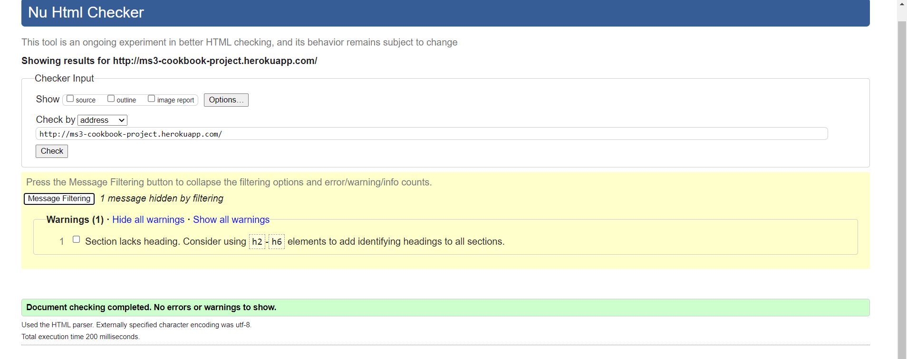
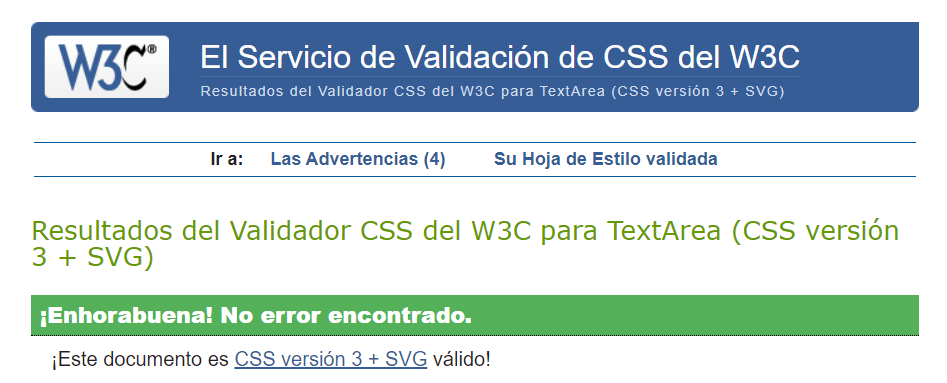
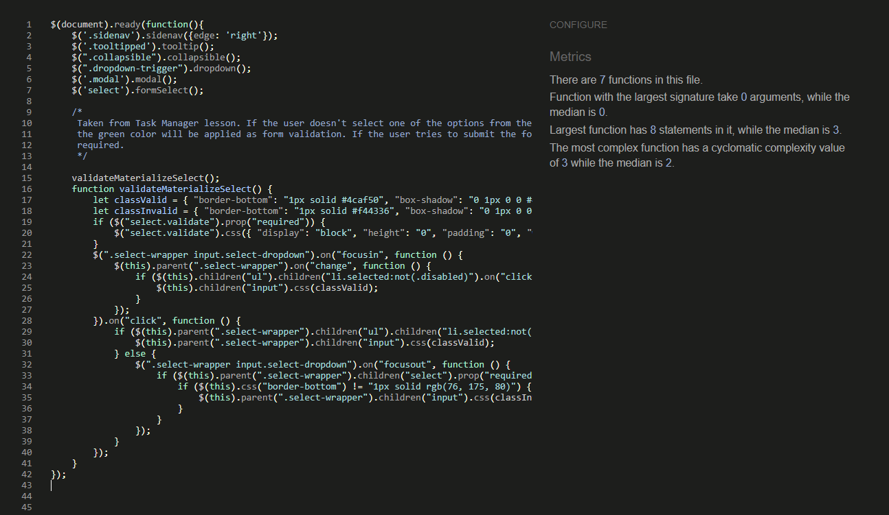

# 
**The Homemade Kitchen**

## Milestone 3 Project - Backend Development Milestone Project

### [View live project here](https://ms3-cookbook-project.herokuapp.com/)

## OVERVIEW

The main reason behind creating this test documentation is to reduce any bugs and errors left on the software, like not working links, responsive issues, font-sizes... and this way improve User Experience and increase traffic to the site.

From the very beggining I used Google Chrome Dev Tools to style and fix the code on real time. This helped fix mistakes and errors on a timely manner as the tool helped to see responsive, styling and typo errors as I coded.

Once finished, I tested my site on a two different phones, laptop, tablet and desktop as well as DevTools and different browsers manually.

## Table of Content

1. [USER STORIES](#user-stories-testing)
    - [Anonymous user](#anonimus-user)
    - [Registered user](#registered-user)
    - [Admin user](#admin-user)
2. [VALIDATOR CHECKS](#validator)
    - [HTML](#html-validator)
    - [CSS](#css-validator)
    - [JSHint](#jshint-validator)
3. [LIGHTHOUSE TESTING](#lighthouse-testing)
   - Mobile
   - Desktop
4. [DEVICE RESPONSIVENESS](#device-responsiveness)
5. [BROWSER COMPATIBILITY](#browser-compatibility)
6. [BUGS](#bugs)
7. [KNOWN BUGS](#known-bugs)
8. [BACK TO README.md](README.md)

## USER STORIES TESTING

### **User stories**

#### Anonymous user:

- see all the recipes on the main page:
    - When the user loads the page, it brings the to the page where all recipes are displayed. This is available to non registered or anonymous users.
    

- to be able to find information effortessly:
    - Any user has the option to search for specific recipes by name, by difficulty or course type
    
    
    
    - There is a view full recipe button to open the recipe on a separate page where all the information is displayed
    
    

- not to be able to add any recipes without registered
    - Users have a button on under the navbar which will redirect them to the login page.
    
    
- Not to be able to edit/add/remove any recipes others have created
    - users are not able to add, edit or delete any recipes without being logged in. No buttons are displayed unless a user is logged.  
    - Anonymous users are not able to see any of the buttons available at the bottom of the recipe card.
    

#### Registered user:

- be able to manage my own posts by editing and/or deleting them
    - registered and logged users are able to manage only the recipes they have created from various places.
    
    

    - If the user tries to delete a recipe they created, a modal will be triggered to check if they want to continue with their operation. In the same modal the user is given the option to edit or cancel instead of deleting the recipe.
    
    - Only session users can edit their own recipes. Not available on others recipe (see red box)
    
- be able to create my own recipes and post them for everyone to see them
    - uppon loggin, the user is redirected to the users profile where they can add a recipe from a call to action button located on it, or from the main page where the user has the add recipe button on the top and in the navigation links
    
    
- not to be allowed to remove any other posts except mine
    - in the same way as the visible button for only authorized and logged users, the user can only see the delete button on the recipes that the session user has created. This targets the recipe_by key value. Only username and recipe by matching recipes are available to see to the user. 
    

- not to lose any recipes because others have removed it
    - As the option before, other users don't have the option to see my recipes either.

 #### Admin user:

- be able to delete any users recipes:
    - the admin user has the option to delete all users recipes
    
- be able to edit any users recipes
    - the admin user has the option to edit all users recipes
    
- have unique access to all features 
    - the admin user has access to all funtionality. Admin can delete, edit any course created by any registered user. Furthermore, the user has unique tab for managing categories that are displayed for all user at the time of creating a recipe. This option allows admin user to add, edit and remove course types.
    
    

---

## VALIDATOR:

During the whole project, I continuously checked my code using W3 Validators to make sure I fixed my code as I wrote it. At the end, I ran all the finished pages and made sure all the errors were fixed.

As a css validator, I also used w3 Validator to make sure it checked my style.css file to CSS level 3 + SVG standards.

(See passed validator results at the end of HTML and CSS sections)

### HTML Validator:
    - As to develop this project with the [Jinja Templating Engine](https://jinja.palletsprojects.com/en/3.0.x/), the validator would count all url_for() as errors. So I had to validate the code introducing the URL on the [W3 Validator](https://validator.w3.org/) to check the whole website.
    - Although the validator gave a warning because a section did not have a header, the reason for this is that this section only shows if there is a message to give feedback to the user. So no header is needed in this case.
    

### CSS Validator
    - The [jigsaw validator](https://jigsaw.w3.org/css-validator) did not find any errors.
    

### JSHint Validator
    - [JSHint](https://jshint.com/) did not find any warning or errors.
    
    